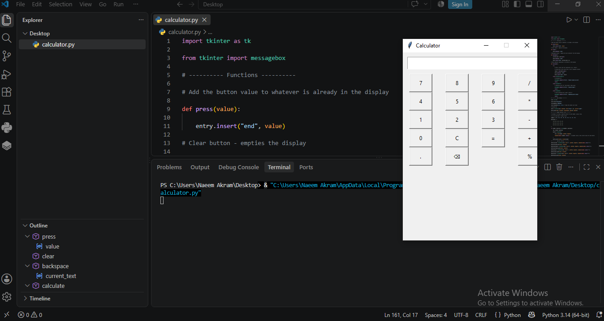

# Calculator Project

## Description
This is a simple calculator application built using Python and Tkinter.

## Features
- Addition
- Subtraction
- Multiplication
- Division
- Clear button
- Error handling for invalid input
- Division by zero handling

## Screenshot



## Technologies Used
- Python
- Tkinter

## How to Run

1. Install Python.
2. Open calculator.py.
3. Run:

```bash
python calculator.py
```

## Future Improvements
- Better UI
- Decimal support
- Percentage (%)
- Square root
- Keyboard support
